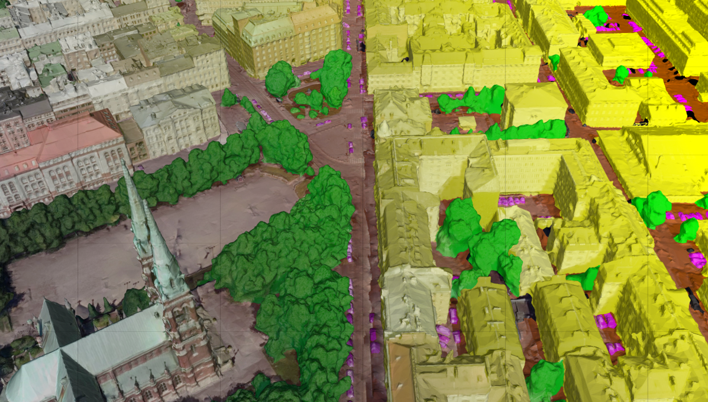

# 🌐 ****************Overview****************

There are 3 programs involved in the segmentation, viewing, and labelling of the meshes. A broad overview of each is given below. 

## SUMS



SUMS: Semantic Urban Mesh Segmentation by TUDelft

- Open-source program for automatic segmentation of large-scale urban meshes (SUMS)
- Implemented in C++ and other open-source libraries, such as [CGAL](https://www.cgal.org/) and [Easy3D](https://github.com/LiangliangNan/Easy3D)
- Read their paper: [SUM: A Benchmark Dataset of Semantic Urban Meshes](https://www.sciencedirect.com/science/article/pii/S0924271621001854)
- [Project website](https://3d.bk.tudelft.nl/projects/meshannotation/)
- It can detect these classes
    
    
    | Label | Classes | RGB |
    | --- | --- | --- |
    | 0 | unclassified | 0, 0, 0 |
    | 1 | terrain | 170, 85, 0 |
    | 2 | high vegetation | 0, 255, 0 |
    | 3 | building | 255, 255, 0 |
    | 4 | water | 0, 255, 255 |
    | 5 | car | 255, 0, 255 |
    | 6 | boat | 0, 0, 153 |

## Mapple

- To visualise labelled output mesh
- Download only available from this [link](https://3d.bk.tudelft.nl/liangliang/software/Mapple.zip) (a `.zip` download of the software will begin upon clicking the link)

## Mesh Annotator

- Allows annotation of urban scenes
- Requirements
    - Input mesh is in **********ASCII********** `*.ply` format
    - Mesh **********must********** be manifold
- Download their release [here](https://github.com/tudelft3d/3D_Urban_Mesh_Annotator/tags)
    - Build-from-source option available using CMake

Tutorial available [here](https://github.com/tudelft3d/3D_Urban_Mesh_Annotator/blob/master/Tutorial.md).

---

# 🚀 **Getting Started**

## 📦 Installation

- Download a release of SUMS [here](https://github.com/tudelft3d/SUMS-Semantic-Urban-Mesh-Segmentation-public/releases)
- Create a folder to unzip the contents to

It can also be built from source using CMake, but this ********************************was not explored********************************. Instructions can be found [here](https://github.com/tudelft3d/SUMS-Semantic-Urban-Mesh-Segmentation-public/tree/main#build-from-source).

## ⚠️ Requirements

- Python 3.7.9
- Windows 10/11
- Imbalanced Learn
    - Install using `pip` or follow their [website](https://imbalanced-learn.org/stable/install.html#getting-started) for other installation options (install in Anaconda, or build from source)
        
        ```powershell
        pip install -U imbalanced-learn
        ```
        
- `wget`
    - In an **************************************************administrative PowerShell**************************************************, install `chocolatey` following [these instructions](https://docs.chocolatey.org/en-us/choco/setup)
    - Install `wget`
        
        ```powershell
        choco install wget
        ```
        

## 📊 Data Requirements

- `*.ply` format triangular meshes
- Associated `.jpeg` format textures of the mesh
- Manifold/Non-manifold Mesh
    - The program claims to only support manifold meshes
    - In testing, meshes fed were not manifold and it still worked
    - Problem comes in the Mesh Annotator - mesh will not load into the annotator if it is not manifold
- Recommended Mesh Size
    - TUDelft team recommends that each tile ********************should be larger than 50 x 50 m********************
    - Classification performance is however generally better on a **********************higher-level (e.g. larger scale with lesser details)********************** mesh, possibly due to it’s similarity with training data

---

# 🔧 Configuration

## 1. Download Demo Data

- Run the following command in the unzipped SUMS folder to download necessary `data_demo` files (a preview of the data can be found [here](https://3d.bk.tudelft.nl/opendata/sum/1.0/data_demo/))
    
    ```python
    wget -r -np -nH --cut-dirs=3 --reject="index.html,index.htm,*tmp" https://3d.bk.tudelft.nl/opendata/sum/1.0/data_demo/
    ```
    
- Download trained model
    - Navigate to `...\your_folder_name\data_demo\model\`
        
        ```powershell
        wget -r -np -nH --cut-dirs=5 --reject="index.html,index.htm,*tmp" --exclude "robots.txt" https://3d.bk.tudelft.nl/opendata/sum/1.0/trained_model/SUM_Helsinki_C6_trained_model/
        ```
        
    - The trained model is in `.gz` format, and is not used for direct decompression. The user can read it directly from the folder by setting the operation mode to ‘Test_config’

## 2. Prepare `config.txt`

In `...\your_folder_name\data_demo\`, there is a `config.txt`. In here, add the respective file paths for:

- `root_path`
    - Add path to data_demo file
        
        ```powershell
        # in config.txt
        root_path = C:/Users/USER/.../your_folder_name/data_demo/
        ```
        
- `seg_aug_py_path`
    - Add path to `seg_aug.py` file
        
        ```powershell
        # in config.txt
        seg_aug_py_path = C:/Users/USER/.../your_folder_name/
        ```
        

## 3. Replace `filter.py`

Replace the `...\Python\Python37\Lib\site-packages\imblearn\over_sampling\_smote\filter.py` with provided `...\your_folder_name\filter.py`

---

# ⏩ Quick Start

**********************************************************************Do this only after configuration has been completed.**********************************************************************

## 1. Run program

- Navigate to the directory where `semantic_urban_mesh_segmentation.exe` is located
- Execute the command below, making sure to **replace it with your specific file path** to where `config.txt` is located
    
    ```python
    .\semantic_urban_mesh_segmentation.exe "C:/Users/USER/.../your_folder_name/data_demo/"
    ```
    

## 2. View Results

- Output mesh is in `...\data_demo\test\output`
- Open with ************Mapple************ to view results

---

# 🗃️ Using Custom Data

## Input Data

- If custom data is not in the required format, convert using
    - MeshLab
        - **Preferred** for conversion because of convenience (exports the `.ply` and automatically “links” it with the corresponding texture files)
        - Ensure `.ply` is exported with its **normals** and in ************ASCII************ format
        - Format of texture files can be changed by changing the name during export to end in “.jpeg”
    - Blender
        - Export converted mesh and texture in necessary file formats
        - In exported `.ply` file, add the following lines at the top **for each corresponding texture file**, changing “texture_0.jpeg” to the name of your texture
            
            ```powershell
            comment TextureFile texture_0.jpeg
            ```
            
- Put the meshes into `...\your_folder_name\data_demo\test\input`
- Run the program

## Output

- View results using ************Mapple************
- Labels
    - The faces are color coded but the labels are not added (i.e. in the `.ply` file, each face is still “unlabeled” despite having an assigned RGB face color)
    - The RGB values are normalised
    - An example code to add the labels is available in the example code folder

---

# 🎨 Options

## **Operation modes**

All operation modes and their descriptions can be found [here](https://github.com/tudelft3d/SUMS-Semantic-Urban-Mesh-Segmentation-public#operation-modes).

## Customisation and Configuration Options

All these options can be modified within `config.txt`

- **Detection**
    - Classes
        - By default, it detects 6 classes classes
        - Detected classes can only be modified by removing them, adding new classes are not possible
    - Label Colors
        - The colors of the associated labels can be changed
- **Saving Intermediate Data**
    - Intermediate data such as sampled point clouds, over-segmentation mesh and texture clouds can be saved
- **Fine-Tuning Parameters**
    - For a broad overview, there are parameters that deal with
        - Data processing
        - Mesh and texture processing
        - Mesh segmentation and region growing
        - Feature selection and usage
        - Random Forest
        - Batch processing

---

# ❗Problems Faced/Issues

## How to export .ply and .jpeg?

- Refer to custom data section

## Program Not Running

- Following the examples given
    - Ensure slashes are forward/backward
    - Ensure ending slashes
- In `config.txt`, ensure file paths are
    - Without inverted commas
    - Are absolute file paths

## Unable to find `encodings`

Ensure that Python is 3.7.9

## Distorted Output Mesh

If the original data is in `.glb` format, it cause errors and the conversion from 

glb → gltf → glb → ply might be necessary. Code to do it can be found in

## Not reading input texture files

Ensure that the `.ply` file is “linked” to its respective `.jpeg` file by

1. Opening the `.ply` file in a text editor
2. Checking the comments at the top of the file. **For each corresponding texture file**, there should be a comment as below. Change “texture_0.jpeg” to the name of the corresponding texture file.
    
    ```powershell
    comment TextureFile texture_0.jpeg
    ```
    