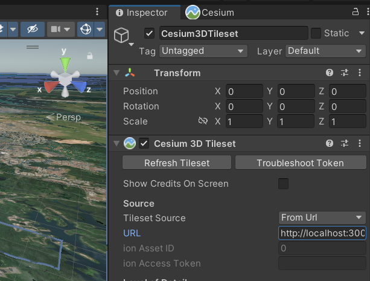

# Viewing In Unity


1. Follow the set-up instructions under [webserver](https://github.com/leehananne/Tile-Segmentation-Pipeline/tree/main/webserver)

2. In Unity, under **Inspector** and ********Cesium 3D Tileset********.

For instance,
```
.
├── tileset/
│   └── root.json
└── webserver/
    ├── app.js
    ├── package.json
    └── package-lock.json
```
Replace the URL with http://localhost:3000/root.json
    
    